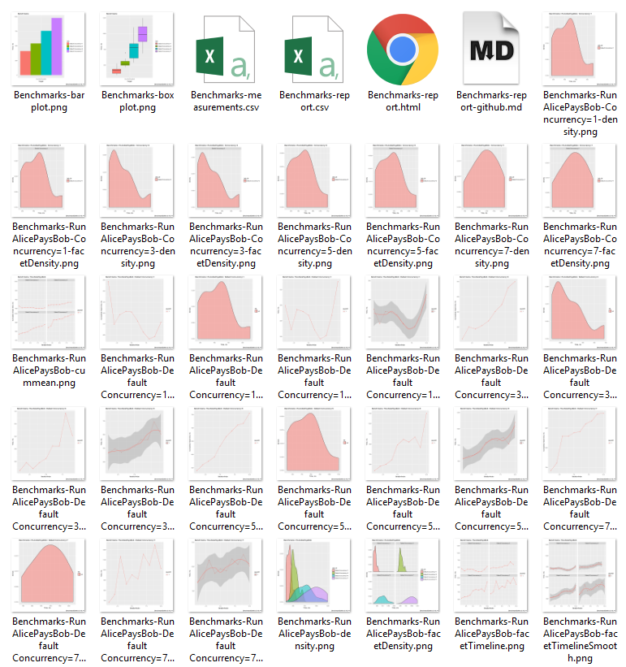
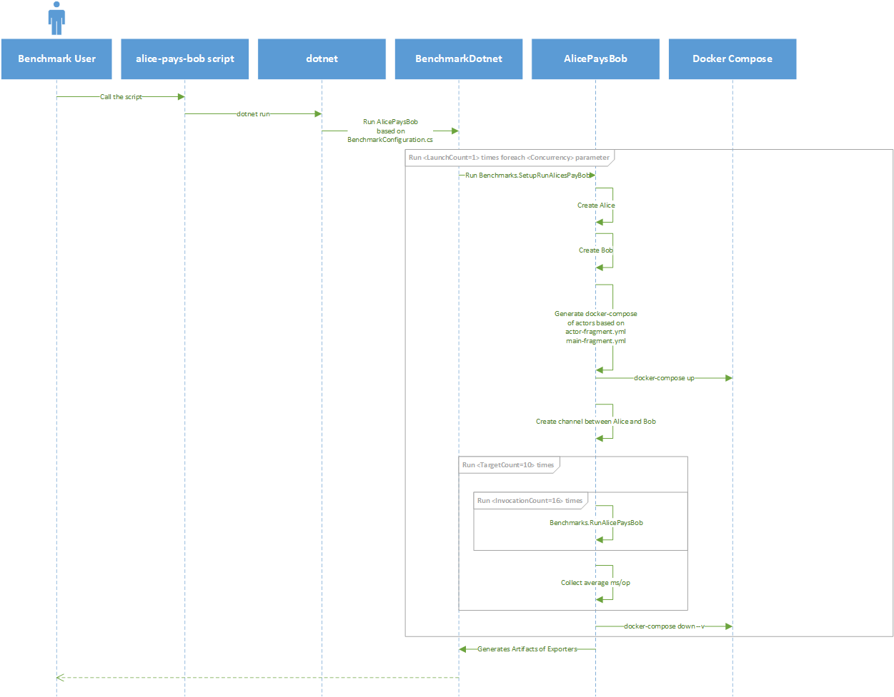
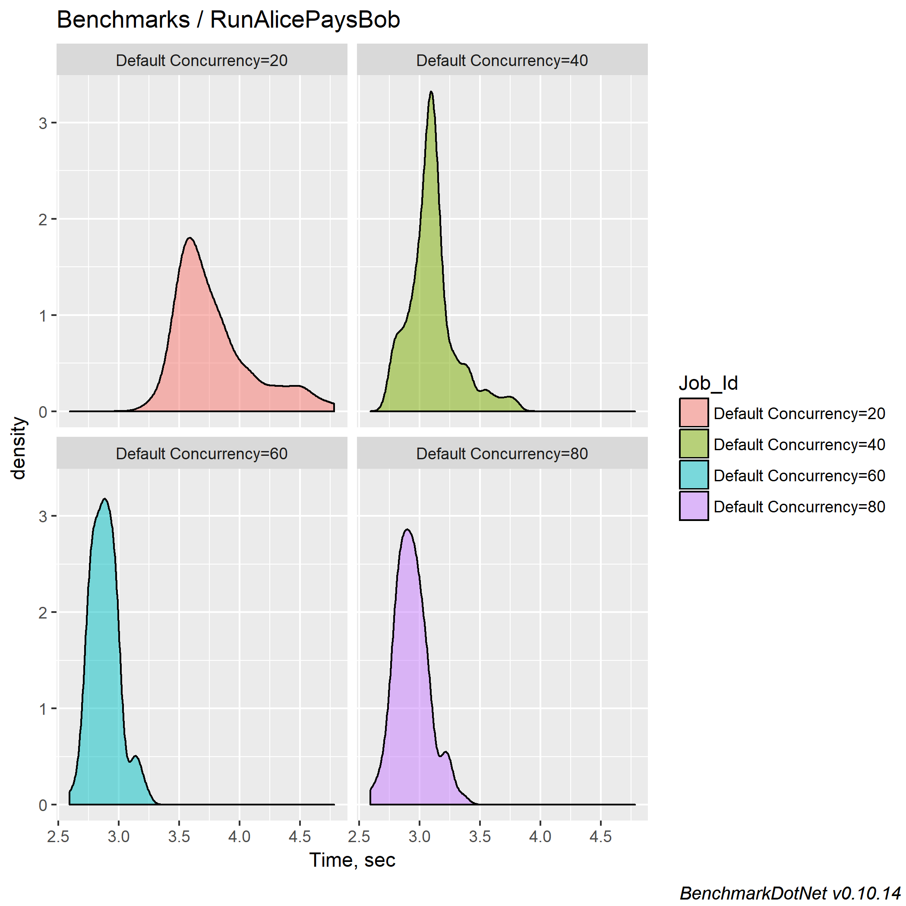
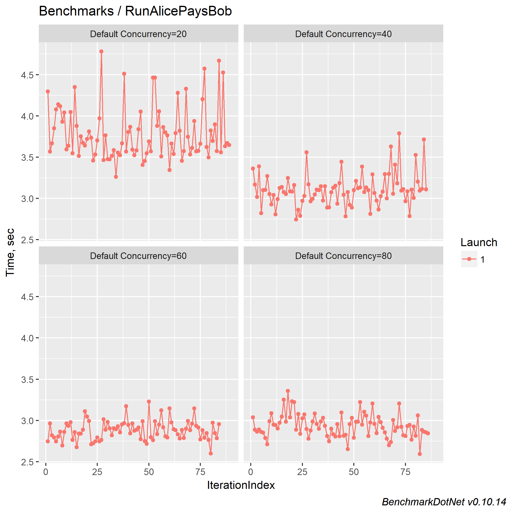
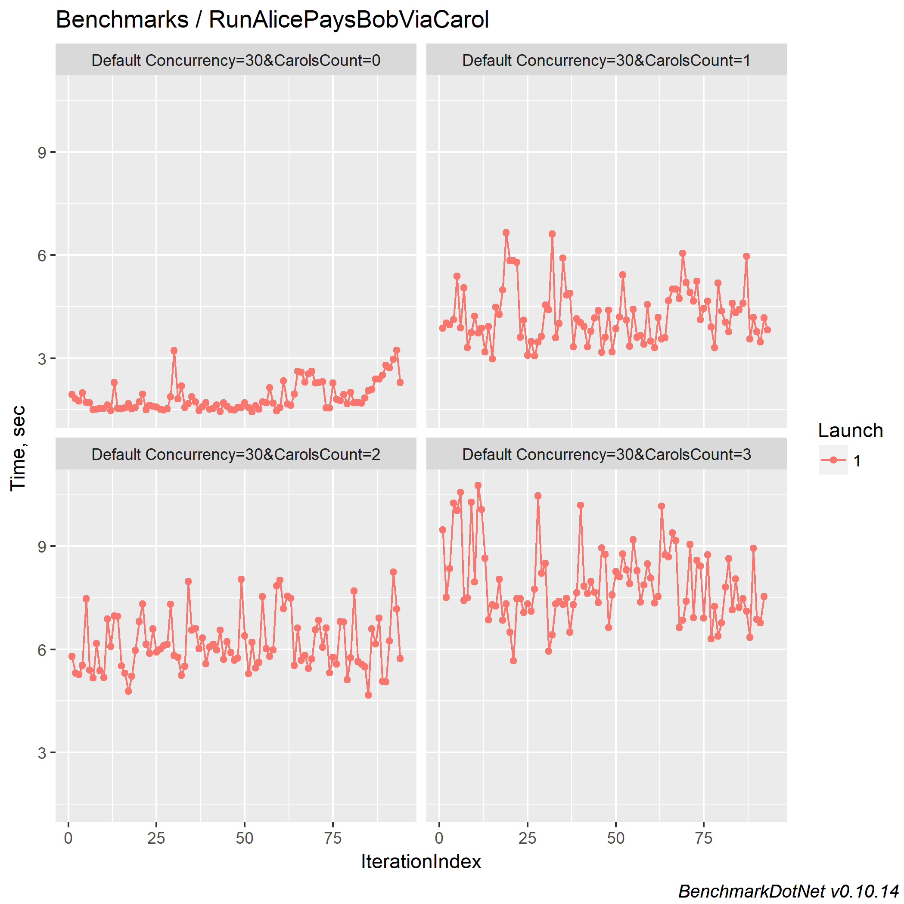
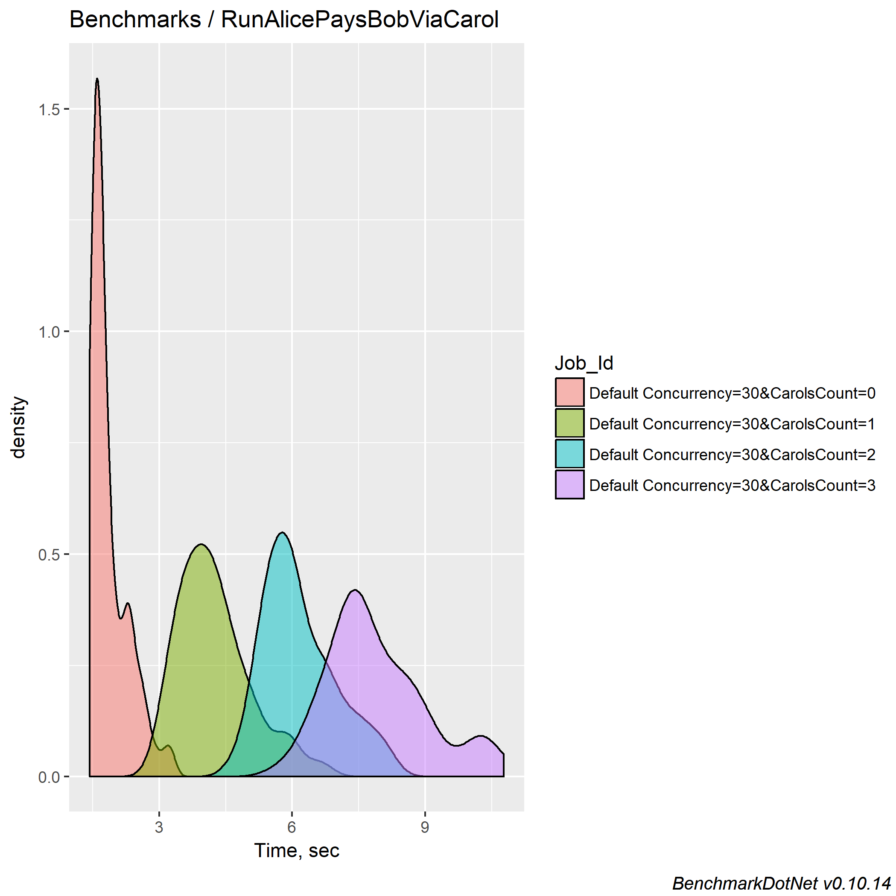
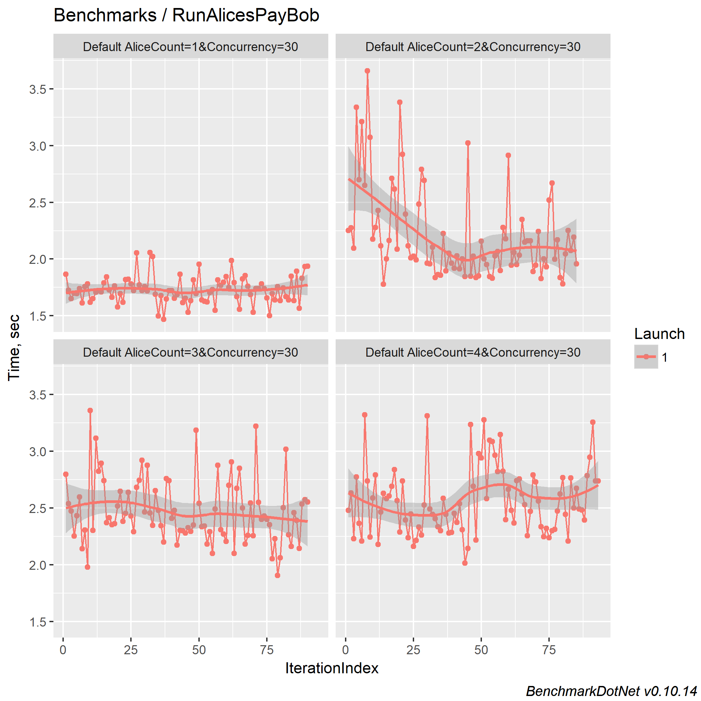

# Lightning Benchmark

## Abstract

This repository is aimed to provide an easy way for lightning network protocol implementer to benchmark their own implementation and compare them.
It also provide a way to compare performance accross different implementation by leveraging [BenchmarkDotnet](https://benchmarkdotnet.org/).
The benchmark will produce raw data and plot output file which make it easy for the implementer to draw his conclusion. 
By reading the [BenchmarkDotnet](https://benchmarkdotnet.org/) documentation, you can easily support different output format or tweak existing one.

This document explains the structure of this project then present a small analysis on the currently benchmarked scenaris so you can understand how to tweak it by yourself, share and reproduce results.

Those tests relies on [this clightning commit](https://github.com/NicolasDorier/lightning/commit/d9eba0e924538d41a9fbb016193633c9cb6de76b) on [Alpine environment](https://github.com/ElementsProject/lightning/pull/1318).

Even if this README is analysing three different scenaris, this is not the point of this project.

This project aims at providing a framework to benchmark any scenari, allow you to share the results, and make sure other peers can reproduce them.

This work has been done by [DG Lab's Blockchain team](https://www.dglab.com/) for the [BSAFE.NETWORK LAYER 2 TECHNOLOGY COMPETITION](http://bsafe.network/technology-competiton/leyer2competition/).

## Design rationale

We are leveraging `docker` and `docker-compose` to create a reliable and reproducible environment on any OS supporting `docker`.
`docker-compose` provides a simple file format to describe what image of what program should run, and how those program connect together.
By doing this, not only we eliminate human errors caused by not properly running and configuring software together, but we don't have to provide OS specific instructions to make use of this project.

In the following section we will detail how this project is organized by following how to run the following hypothetic scenario and how we can analyze issues: 

* How fast can run Alice can pays Bob.
* How fast can Alice pays Bob through Carol.
* How fast Alices can pays Bob.

## Pre-requisite

Pre-requisite depends only on docker and .NET Core

* Docker
* Docker-Compose
* .NET Core SDK 2.0 as specified by [Microsoft website](https://www.microsoft.com/net/download). (2.1 should also work fine)

To generate plots successfully you need additionally:

* [R 3.5.0](https://www.r-project.org/) to generate plots.
* Make sure `RScript` is in your `PATH`, or set set `R_HOME` set to the base R directory (`C:\Program Files\R\R-3.5.0` on Windows)

If you want to edit code, we advise you to use Visual Studio 2017 on Windows or Visual Studio Code elsewhere.

## System overview

All benchmarks starts by running the `run` script.

On Windows:
```powershell
git clone git@github.com:dgarage/LightningBenchmarks.git
cd LightningBenchmarks\bench\Lightning.Bench
.\run.sh
```

On Linux/Mac:
```bash
git clone git@github.com:dgarage/LightningBenchmarks.git
cd LightningBenchmarks/bench/Lightning.Bench
./run.sh
```

You can then see the artifacts in `bench/Lightning.Bench/BenchmarkDotNet.Artifacts` folder.



The following happens when if you `run` script:

1. `run` calls `dotnet run` which build and run the project
2. The project starts `BenchmarkDotnet` based on the [configuration](bench/Lightning.Bench/BenchmarkConfiguration.cs).
3. `BenchmarkDotnet` runs `Benchmarks.SetupRunAlicesPayBob`. This will generate the docker-compose of the test environment and run it, as well as open channels between actors.
4. Running 10 iterations of 16 runs of `Benchmarks.RunAlicePaysBob`. (As configured in the [configuration](bench/Lightning.Bench/BenchmarkConfiguration.cs))
5. Each iterations average the performance of its runs and plot one point.
6. The exporters configured in the [configuration](bench/Lightning.Bench/BenchmarkConfiguration.cs) will generate the artifacts.

You can tweak `BenchmarkConfiguration` for your own analysis need, check the [documentation](https://benchmarkdotnet.org/index.htm).



---
NOTICE: We recompiled lightningd to activate compiler optimizations. Those optimizations are not part of the default docker image which is pulled by this project.

OPTIONAL: if you want to turn on optimizations, you need to recompile the `clightning` image.

1. Git clone
```bash
git clone https://github.com/NicolasDorier/lightning
cd lightning
git checkout dockerfile
```
2. Apply the following patch
```diff
diff --git a/Makefile b/Makefile
index 5bd73721..19914766 100644
--- a/Makefile
+++ b/Makefile
@@ -165,8 +165,8 @@ WIRE_GEN := tools/generate-wire.py
-CWARNFLAGS := -Werror -Wall -Wundef -Wmissing-prototypes -Wmissing-declarations -Wstrict-prototypes -Wold-style-definition
-CDEBUGFLAGS := -std=gnu11 -g -fstack-protector
+CWARNFLAGS := -Werror -Wall -Wundef -Wmissing-prototypes -Wmissing-declarations -Wstrict-prototypes -Wold-style-definition -Wno-unused-but-set-variable -Wno-maybe-uninitialized
+CDEBUGFLAGS := -std=gnu11 -O3
```
3. Build the image
```bash
# Be careful "v0.6" might change, it should match what is inside bench/Lightning.Bench/docker-fragments/actor-fragment.yml
docker build --build-arg DEVELOPER=1 --build-arg TRACE_TOOLS=true -t nicolasdorier/clightning:v0.6-bench .
```
---

## Tweaking implementation's code

While by default running the benchmark will currently be based on [this tag](https://github.com/NicolasDorier/lightning/tree/v0.6-docker), you might want to benchmark, change the code and benchmark again and compare results.

```bash
git clone https://github.com/NicolasDorier/lightning
cd lightning
git checkout dockerfile
```

Then tweak the code you want. You can also rebase the branch on another commit.

Then build the image.
```
# Be careful "v0.6" might change, it should match what is inside bench/Lightning.Bench/docker-fragments/actor-fragment.yml
docker build --build-arg DEVELOPER=1 --build-arg TRACE_TOOLS=true -t nicolasdorier/clightning:v0.6-bench .
```

## Scenario: Alice pays Bob

### Explanation

You can load this example the following command in the root folder of this project, this part describe what happen if you run it:

```bash
git checkout contest-RunAlicePaysBob
cd LightningBenchmarks/bench/Lightning.Bench
./run.sh
```

When you ran `run` script, the default scenario, BenchmarkDotNet will find all methods with the `[Benchmark]` attribute inside `Benchmarks.cs`.

As you can see, `RunAlicePaysBob` is running concurrently (`Concurrency` times) the following code:
The code try to process `TotalPayments=100` invoices for each run.

```CSharp
[Benchmark]
public async Task RunAlicePaysBob()
{
	int paymentsLeft = TotalPayments;
	await Task.WhenAll(Enumerable.Range(0, Concurrency)
		.Select(async _ =>
		{
			while(Interlocked.Decrement(ref paymentsLeft) >= 0)
			{
				var invoice = await Bob.GetRPC(_).CreateInvoice(LightMoney.Satoshis(100));
				await Alice.GetRPC(_).SendAsync(invoice.BOLT11);
			}
		}));
}
```

`Concurrency` is defined above as:

```CSharp
[Params(20, 40, 60, 80)]
public int Concurrency
{
	get; set;
} = 1;
```

So this mean `RunAlicePaysBob` benchmark will launch 4 times with different concurrency levels. (20, 40, 60, 80)

`RunAlicePaysBob` is assuming that Alice and Bob have a channel. The environment is setup inside `SetupRunAlicesPayBob`.

```CSharp
[GlobalSetup(Target = nameof(RunAlicePaysBob))]
public void SetupRunAlicesPayBob()
{
	Tester = Tester.Create();
	Alice = Tester.CreateActor("Alice");
	Bob = Tester.CreateActor("Bob");
	Tester.Start();
	Tester.CreateChannel(Alice, Bob).GetAwaiter().GetResult();
}
```

### Results

``` ini	

BenchmarkDotNet=v0.10.14, OS=Windows 10.0.16299.492 (1709/FallCreatorsUpdate/Redstone3)
Intel Core i7-6500U CPU 2.50GHz (Skylake), 1 CPU, 4 logical and 2 physical cores
Frequency=2531248 Hz, Resolution=395.0620 ns, Timer=TSC
.NET Core SDK=2.1.300
  [Host]     : .NET Core 2.0.7 (CoreCLR 4.6.26328.01, CoreFX 4.6.26403.03), 64bit RyuJIT
  Job-FFGKFX : .NET Core 2.0.7 (CoreCLR 4.6.26328.01, CoreFX 4.6.26403.03), 64bit RyuJIT

InvocationCount=1  LaunchCount=1  TargetCount=100  
UnrollFactor=1  WarmupCount=0  

```
|          Method | Concurrency |    Mean |    Error |   StdDev |  Median |  Payment/sec |
|---------------- |------------ |--------:|---------:|---------:|--------:|--------:|
| **RunAlicePaysBob** |          **20** | **3.788 s** | **0.1168 s** | **0.3237 s** | **3.672 s** | **27.23** |
| **RunAlicePaysBob** |          **40** | **3.106 s** | **0.0739 s** | **0.1998 s** | **3.095 s** | **32.31** |
| **RunAlicePaysBob** |          **60** | **2.881 s** | **0.0439 s** | **0.1180 s** | **2.882 s** | **34.69** |
| **RunAlicePaysBob** |          **80** | **2.935 s** | **0.0516 s** | **0.1403 s** | **2.925 s** | **34.18** |


We topped we a mean of `34 payments per second` achieved by having `60 simultaneous requests`.




## Scenario: Alice pays Bob via Carols

### Explanation

You can load this example the following command in the root folder of this project, this part describe what happen if you run it:

```bash
git checkout contest-RunAlicePaysBobViaCarol
cd LightningBenchmarks/bench/Lightning.Bench
./run.sh
```

This test is aimed at benchmarking the influence of intermediaries (Carols) on a payment between Alice and Bob.

For this, before running `run` script, we fix `Concurrency` to 60, and will set `CarolsCount` to 0, 1, 2, 3.

Then we deactivate the `RunAlicePaysBob` test and activate `RunAlicePaysBobViaCarol`.

We also changed `TotalPayments` to `50` so the test are faster, and divided by two the concurrency accordingly.

```diff
diff --git a/bench/Lightning.Bench/Benchmarks.cs b/bench/Lightning.Bench/Benchmarks.cs
index 09fedd0..2589220 100644
--- a/bench/Lightning.Bench/Benchmarks.cs
+++ b/bench/Lightning.Bench/Benchmarks.cs
@@ -19,7 +19,7 @@ namespace Lightning.Tests
                        get; set;
                } = 5;

-               [Params(20, 40, 60, 80)]
+               [Params(30)]
                public int Concurrency
                {
                        get; set;
@@ -28,9 +28,9 @@ namespace Lightning.Tests
                public int TotalPayments
                {
                        get; set;
-               } = 100;
+               } = 50;

-               //[Params(1, 3, 5)]
+               [Params(0, 1, 2, 3)]
                public int CarolsCount
                {
                        get; set;
@@ -53,7 +53,7 @@ namespace Lightning.Tests
                        Tester.Start();
                        Tester.CreateChannels(new[] { Alice }, new[] { Bob }).GetAwaiter().GetResult();
                }
-               [Benchmark]
+               //[Benchmark]
                public async Task RunAlicePaysBob()
                {
                        int paymentsLeft = TotalPayments;
@@ -87,7 +87,7 @@ namespace Lightning.Tests
                        Tester.CreateChannels(froms, tos).GetAwaiter().GetResult();
                        Alice.WaitRouteTo(Bob).GetAwaiter().GetResult();
                }
-               //[Benchmark]
+               [Benchmark]
                public async Task RunAlicePaysBobViaCarol()
                {
                        int paymentsLeft = TotalPayments;
```

### Results

``` ini

BenchmarkDotNet=v0.10.14, OS=Windows 10.0.16299.492 (1709/FallCreatorsUpdate/Redstone3)
Intel Core i7-6500U CPU 2.50GHz (Skylake), 1 CPU, 4 logical and 2 physical cores
Frequency=2531248 Hz, Resolution=395.0620 ns, Timer=TSC
.NET Core SDK=2.1.300
  [Host]     : .NET Core 2.0.7 (CoreCLR 4.6.26328.01, CoreFX 4.6.26403.03), 64bit RyuJIT
  Job-MIVEIF : .NET Core 2.0.7 (CoreCLR 4.6.26328.01, CoreFX 4.6.26403.03), 64bit RyuJIT

InvocationCount=1  LaunchCount=1  TargetCount=100  
UnrollFactor=1  WarmupCount=0  

```
|                  Method | Concurrency | CarolsCount |    Mean |    Error |   StdDev |  Median |  Payments/s |
|------------------------ |------------ |------------ |--------:|---------:|---------:|--------:|--------:|
| **RunAlicePaysBobViaCarol** |          **30** |           **0** | **1.860 s** | **0.1459 s** | **0.4163 s** | **1.702 s** | **29.37** |
| **RunAlicePaysBobViaCarol** |          **30** |           **1** | **4.245 s** | **0.2863 s** | **0.8123 s** | **4.121 s** | **12.13** |
| **RunAlicePaysBobViaCarol** |          **30** |           **2** | **6.160 s** | **0.2840 s** | **0.8104 s** | **6.002 s** | **8.33** |
| **RunAlicePaysBobViaCarol** |          **30** |           **3** | **7.913 s** | **0.3980 s** | **1.1226 s** | **7.606 s** | **6.57** |





Adding hops is impacting the throughput linearly.

## Scenario: Alices pay Bob

### Explanation

You can load this example the following command in the root folder of this project, this part describe what happen if you run it:

```bash
git checkout contest-RunAlicesPayBob
cd LightningBenchmarks/bench/Lightning.Bench
./run.sh
```

In this scenario, we will study the influence of multiple Alices paying the same Bob, and will compare this to the first `Alice pays Bob` scenario.

We fixed `Concurrency` and varied `AliceCount`.

```diff
diff --git a/bench/Lightning.Bench/Benchmarks.cs b/bench/Lightning.Bench/Benchmarks.cs
index 09fedd0..76e3154 100644
--- a/bench/Lightning.Bench/Benchmarks.cs
+++ b/bench/Lightning.Bench/Benchmarks.cs
@@ -13,13 +13,13 @@ namespace Lightning.Tests
 {
        public class Benchmarks
        {
-               //[Params(4, 7, 10)]
+               [Params(1, 2, 3, 4)]
                public int AliceCount
                {
                        get; set;
                } = 5;

-               [Params(20, 40, 60, 80)]
+               [Params(30)]
                public int Concurrency
                {
                        get; set;
@@ -28,7 +28,7 @@ namespace Lightning.Tests
                public int TotalPayments
                {
                        get; set;
-               } = 100;
+               } = 50;

                //[Params(1, 3, 5)]
                public int CarolsCount
@@ -53,7 +53,7 @@ namespace Lightning.Tests
                        Tester.Start();
                        Tester.CreateChannels(new[] { Alice }, new[] { Bob }).GetAwaiter().GetResult();
                }
-               [Benchmark]
+               //[Benchmark]
                public async Task RunAlicePaysBob()
                {
                        int paymentsLeft = TotalPayments;
@@ -123,7 +123,7 @@ namespace Lightning.Tests
                        Task.WaitAll(Alices.Select(a => a.WaitRouteTo(Bob)).ToArray());
                }

-               //[Benchmark]
+               [Benchmark]
                public async Task RunAlicesPayBob()
                {
                        int paymentsLeft = TotalPayments;
```

### Results

Let's compare the result of X Alices payment 1 Bob versus 1 Alice paying 7 time at once 1 Bob. The result is as follow:

``` ini

BenchmarkDotNet=v0.10.14, OS=Windows 10.0.16299.492 (1709/FallCreatorsUpdate/Redstone3)
Intel Core i7-6500U CPU 2.50GHz (Skylake), 1 CPU, 4 logical and 2 physical cores
Frequency=2531248 Hz, Resolution=395.0620 ns, Timer=TSC
.NET Core SDK=2.1.300
  [Host]     : .NET Core 2.0.7 (CoreCLR 4.6.26328.01, CoreFX 4.6.26403.03), 64bit RyuJIT
  Job-FVRONC : .NET Core 2.0.7 (CoreCLR 4.6.26328.01, CoreFX 4.6.26403.03), 64bit RyuJIT

InvocationCount=1  LaunchCount=1  TargetCount=100  
UnrollFactor=1  WarmupCount=0  

```
|          Method | AliceCount | Concurrency |    Mean |    Error |   StdDev |  Median |  Payments / s |
|---------------- |----------- |------------ |--------:|---------:|---------:|--------:|--------:|
| **RunAlicesPayBob** |          **1** |          **30** | **1.728 s** | **0.0426 s** | **0.1186 s** | **1.722 s** | **29.03** |
| **RunAlicesPayBob** |          **2** |          **30** | **2.208 s** | **0.1491 s** | **0.4031 s** | **2.067 s** | **24.18** |
| **RunAlicesPayBob** |          **3** |          **30** | **2.473 s** | **0.1012 s** | **0.2820 s** | **2.423 s** | **20.63** |
| **RunAlicesPayBob** |          **4** |          **30** | **2.565 s** | **0.1035 s** | **0.2938 s** | **2.500 s** | **20** |



We can see we are capped at maximum `4.27 payment per seconds` for 4 Alices versus `10.00 payment per seconds` for 1 Alices paying 10 times at once.

## Diving into the code with flame graphs

We identified that the more invoice and payment was created, the longer it take to make a new one. It would be nice to be able to dive into profiling code so we can identify issues.

However, our current profiling turned on compiler optimization.
Let's delete our current docker image so the one from docker hub (without our custom changes) get downloaded.

```bash
docker rmi nicolasdorier/clightning:0.0.0.20-bench
```

We will run `Alice pays Bob` with concurrency of `7` for an undefined amount of time.
While this bench is running, we will sample the stacktrace for `1 min` every `5 min` for Alice and Bob and generate a flamegraph everytimes.

We will then analyse those flamegraph over time and check if we can deduce something out of it.

Returns to original `Alice pays Bob` benchmark by running
```bash
git reset --hard HEAD
```

Then configure it to run indefinitely with 7 concurrent payments.
```diff
diff --git a/bench/Lightning.Bench/BenchmarkConfiguration.cs b/bench/Lightning.Bench/BenchmarkConfiguration.cs
index 10a6ac4..6526d15 100644
--- a/bench/Lightning.Bench/BenchmarkConfiguration.cs
+++ b/bench/Lightning.Bench/BenchmarkConfiguration.cs
@@ -23,7 +23,7 @@ namespace Lightning.Bench
 			Add(RPlotExporter.Default);
 
 			var job = new Job();
-			job.Run.TargetCount = 10;
+			job.Run.TargetCount = 1000;
 			job.Run.LaunchCount = 1;
 			job.Run.WarmupCount = 0;
 			job.Run.InvocationCount = 16;
diff --git a/bench/Lightning.Bench/Benchmarks.cs b/bench/Lightning.Bench/Benchmarks.cs
index 8ec418b..651e451 100644
--- a/bench/Lightning.Bench/Benchmarks.cs
+++ b/bench/Lightning.Bench/Benchmarks.cs
@@ -19,7 +19,8 @@ namespace Lightning.Tests
 			get; set;
 		} = 5;
 
-		[Params(1, 4, 7, 10)]
+		//[Params(1, 4, 7, 10)]
+		[Params(7)]
 		public int Concurrency
 		{
 			get; set;

```
Run with the `run.sh`/`run.ps1` script.

In the logs you will have a link to the benchmark directory, this is where the flamegraph will by generated.
```
WORKING DIRECTORY: C:\Users\NicolasDorier\Documents\Sources\LightningBenchmarks\bench\Lightning.Bench\bin\Release\netcoreapp2.0\69c5910a-8f5e-4eea-a94f-d8d38eea977c\bin\Release\netcoreapp2.0\lightningbench
```
When you see that the tests start running by seeing
```
// BeforeMainRun
MainTarget  1: 16 op, 7596177618.24 ns, 474.7611 ms/op
MainTarget  2: 16 op, 7174115229.28 ns, 448.3822 ms/op
MainTarget  3: 16 op, 9179380219.01 ns, 573.7113 ms/op
MainTarget  4: 16 op, 7582696526.50 ns, 473.9185 ms/op
```
Run the following commands on two different shell:
```bash
docker exec lightningbench_Alice_1 bash -c sample-loop.sh
```
Sampling slow down the target process, so it is better to not sample both actor at the same time:
```bash
sleep 120
docker exec lightningbench_Bob_1 bash -c sample-loop.sh
```

Those are unlimited loops taking sampling stacktraces for `1 minute` every `5 minutes`.
The results get saved in `BENCHMARK_DIRECTORY\Alice_traces` and `BENCHMARK_DIRECTORY\Bob_traces`.

Note that on top of this, you can connect via back to Bob or alice via:

```bash
docker exec -ti lightningbench_Bob_1 bash
```
You can use this to use utilities like `top` to monitor how CPU is affected, or use `gdb`...

Once you are done, just hit `CTRL+C` on the terminal running `run` script to stop benchmark.
You can format your finding into one image with [imagemagick](http://imagemagick.org/)

Inside your benchmark directory:

```bash
cd Alice_traces
convert *.svg -crop 1200x550+0+1584 cropped.jpg
convert cropped-*.jpg -append merged.jpg
cd ..
cd Bob_traces
convert *.svg -crop 1200x550+0+1584 cropped.jpg
convert cropped-*.jpg -append merged.jpg
cd ..
convert Alice_traces/merged.jpg Bob_traces/merged.jpg +append traces.jpg
```

This will generate an unified graph. Left column is `Bob`, right column is `Alice`.
Vertical dimension is time.


This finding is being discussed on [this github issue](https://github.com/ElementsProject/lightning/issues/1506).
It seems to have two separate issues:

* Logging seems to take a huge amount of time (`status_fmt`, `log_status_msg`, `tal_vfmt`)
* `brute_force_first` is also taking lot's of time, as admitted by the writer of [this function](https://github.com/ElementsProject/lightning/blob/8d641456a1167452cd0df20e6fb115702227b41a/ccan/ccan/timer/timer.c#L198).
* The call to `__clone` seems to originate from forked processes not filtering logs before sending them to `lightningd` parent process. (thanks to [ZmnSCPxj](https://github.com/ZmnSCPxj))

Still there is no obvious culprit about the linear scaling issue.

## Artifacts

* [flamegraphs.zip](https://aois.blob.core.windows.net/public/CLightningBenchmarkResults/flamegraphs.zip)
* [AlicePaysBob.zip](https://aois.blob.core.windows.net/public/CLightningBenchmarkResults/AlicePaysBob.zip)
* [AlicesPayBob.zip](https://aois.blob.core.windows.net/public/CLightningBenchmarkResults/AlicesPayBob.zip)
* [AlicePaysBobViaCarol.zip](https://aois.blob.core.windows.net/public/CLightningBenchmarkResults/AlicePaysBobViaCarol.zip)

## Conclusion

Blockstream claimed to have benchmarked `500 transactions per seconds` at [consensus 2018](https://coinjournal.net/scaling-layer-2-and-cryptographic-innovations-discussed-at-consensus-2018/) along with a [recording](https://asciinema.org/a/182054).

Several factors might explain the differences:

1. In Blockstream's benchmark, invoices are pre-generated, only pure payment is benchmarked. In `AlicePaysBob` benchmark, the invoice is generated and sequentially paid.
2. In Blockstream's benchmark, invoices are paid as fast as possible. In our benchmark, invoices are created then paid by batch of 7. The next batch run only when the previous is complete.
3. In Blockstream's benchmark, the test is running on RAM Disk. In our benchmark, tests are run on SSD.
4. In Blockstream's benchmark, tests are run on "bare metal". We are using docker and connecting to clightning via `socat`.
5. Docker might limit CPU resources (even if we took care at configuring it correctly)
6. Our machines specs might differ. (Ours is `Intel Core i7-6500U CPU 2.50GHz (Skylake), 1 CPU, 4 logical and 2 physical cores Frequency=2531249 Hz`)

We also tried to run the same tests on a Virtual Machine hosted on Azure on a [D1v2 instance](https://docs.microsoft.com/en-us/azure/virtual-machines/windows/sizes-general#dv2-series). The performances were slower with similar flamegraphs.

We will work toward replicating the performance claimed as much as possible.
Although, the linear scaling issue and logging perf issues found during our benchmark are unlikely solved by having different hardware.

The performance issues we identified are easily solvable and does not show any fundamental issue at the protocol level. 
We will produce flame graphs again once the issues are solved.

## Remaining work to do

* Support for [Eclair](https://github.com/ACINQ/eclair) and [LND](https://github.com/lightningnetwork/lnd).
* Being able to run different node version side by side to compare the performance on same plots. (This can be done by creating alternative `actor-fragment.yml`)

## License

This work is licensed under [MIT](LICENSE).