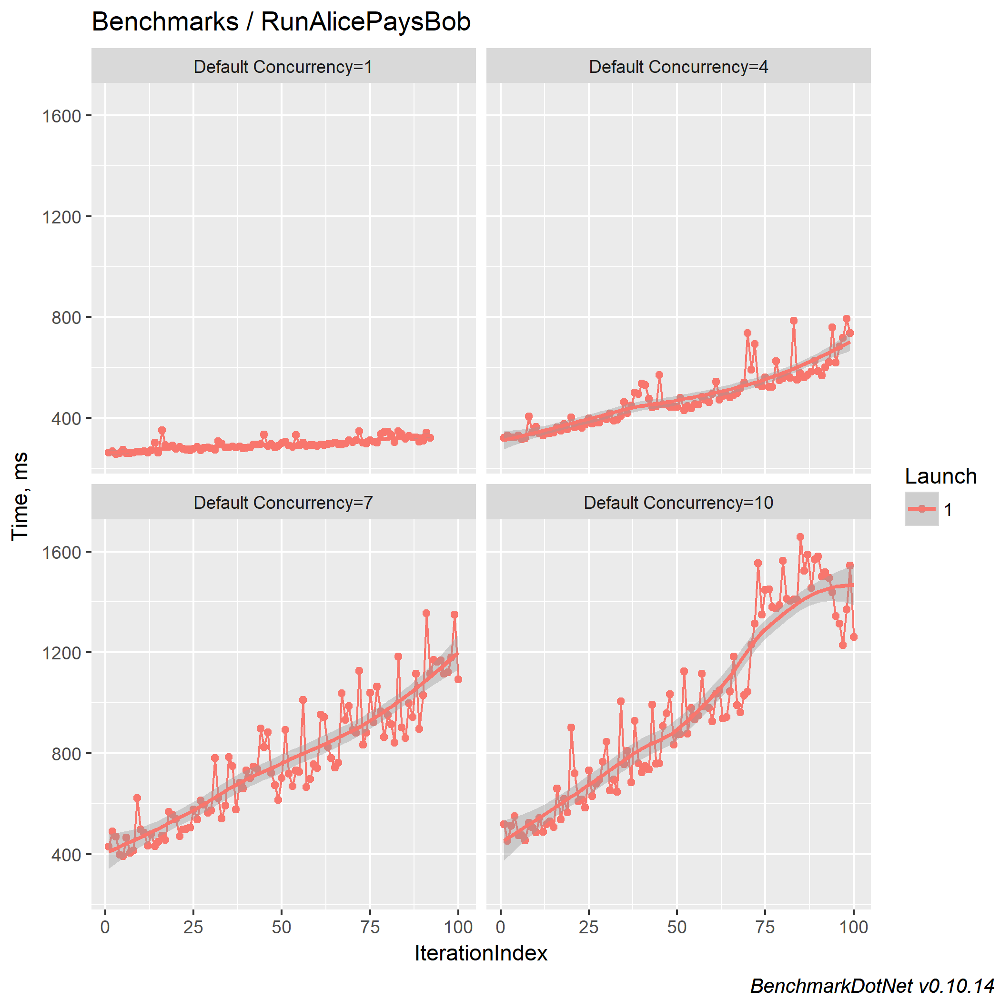

# Lightning Benchmark

## Abstract

This repository is aimed to provide an easy way for lightning network protocol implementer to benchmark their own implementation and compare them.
It also provide a way to compare performance accross different implementation by leveraging [BenchmarkDotnet](https://benchmarkdotnet.org/).
The benchmark will produce raw data and plot output file which make it easy for the implementer to draw his conclusion. 
By reading the [BenchmarkDotnet](https://benchmarkdotnet.org/) documentation, you can easily support different output format or tweak existing one.

It currently only support `c-lightning` on some predefined scenaris presented below.
This document explains the structure of this project then present a small analysis on the currently benchmarked scenaris so you can understand how to tweak it by yourself.

Those tests relies on [this clightning commit](https://github.com/NicolasDorier/lightning/commit/d9eba0e924538d41a9fbb016193633c9cb6de76b) on [Alpine environment](https://github.com/ElementsProject/lightning/pull/1318).

## Design rationale

We are leveraging `docker` and `docker-compose` to create a reliable and reproducible environment on any OS supporting `docker`.
`docker-compose` provides a simple file format to describe what image of what program should run, and how those program connect together.
By doing this, not only we eliminate human errors caused by not properly running and configuring software together, but we don't have to provide OS specific instructions to make use of this project.

In the following section we will detail how this project is organized by following how to run the following hypothetic scenario and how we can analyze issues: 

* How fast can run Alice can pays Bob.
* How fast can Alice pays Bob through Carol.
* How fast Alices can pays Bob.

## Pre-requisite

Pre-requisite depends only on docker and .NET Core

* Docker
* Docker-Compose
* .NET Core SDK 2.0 as specified by [Microsoft website](https://www.microsoft.com/net/download). (2.1 should also work fine)

To generate plots successfully you need additionally:

* [R 3.5.0](https://www.r-project.org/) to generate plots.
* Make sure `RScript` is in your `PATH`, or set set `R_HOME` set to the base R directory (`C:\Program Files\R\R-3.5.0` on Windows)

If you want to edit code, we advise you to use Visual Studio 2017 on Windows or Visual Studio Code elsewhere.

## System overview

All benchmarks starts by running the `run` script.

On Windows:
```powershell
git clone git@github.com:dgarage/LightningBenchmarks.git
cd LightningBenchmarks\bench\Lightning.Bench
.\run.sh
```

On Linux/Mac:
```bash
git clone git@github.com:dgarage/LightningBenchmarks.git
cd LightningBenchmarks/bench/Lightning.Bench
./run.sh
```

You can then see the artifacts in `bench/Lightning.Bench/BenchmarkDotNet.Artifacts` folder.


The following happens when if you `run` script:

1. `run` calls `dotnet run` which build and run the project
2. The project starts `BenchmarkDotnet` based on the [configuration](bench/Lightning.Bench/BenchmarkConfiguration.cs).
3. `BenchmarkDotnet` runs `Benchmarks.SetupRunAlicesPayBob`. This will generate the docker-compose of the test environment and run it, as well as open channels between actors.
4. Running 10 iterations of 16 runs of `Benchmarks.RunAlicePaysBob`. (As configured in the [configuration](bench/Lightning.Bench/BenchmarkConfiguration.cs))
5. Each iterations average the performance of its runs and plot one point.
6. The exporters configured in the [configuration](bench/Lightning.Bench/BenchmarkConfiguration.cs) will generate the artifacts.

You can tweak `BenchmarkConfiguration` for your own analysis need, check the [documentation](https://benchmarkdotnet.org/index.htm).


---
NOTICE: We recompiled lightningd to activate compiler optimizations. Those optimizations are not part of the default docker image which is pulled by this project.

This is optional, but if you want to turn on optimizations, you need to recompile the `clightning` image.

```bash
git clone https://github.com/NicolasDorier/lightning/tree/dockerfile

# Be careful "0.0.0.19" might change, it should match what is inside bench/Lightning.Bench/docker-fragments/actor-fragment.yml
docker build --build-arg DEVELOPER=1 --build-arg TRACE_TOOLS=true -t nicolasdorier/clightning:0.0.0.19-bench .
```
1. Clone [this repository](https://github.com/NicolasDorier/lightning/tree/dockerfile).
2. 

---

## Scenario: Alice pays Bob

### Explanation

When you ran `run` script, the default scenario, BenchmarkDotNet will find all methods with the `[Benchmark]` attribute inside `Benchmarks.cs`.

Only one has the attribute: `RunAlicePaysBob`.
```CSharp
[Benchmark]
public async Task RunAlicePaysBob()
{
	await Task.WhenAll(Enumerable.Range(0, Concurrency)
		.Select(async _ =>
		{
            var invoice = await Bob.RPC.CreateInvoice(LightMoney.Satoshis(100));
            await Alice.RPC.SendAsync(invoice.BOLT11);
		}));
}
```

As you can see, `RunAlicePaysBob` is running concurrently (`Concurrency` times) the following code:

```CSharp
var invoice = await Bob.RPC.CreateInvoice(LightMoney.Satoshis(100));
await Alice.RPC.SendAsync(invoice.BOLT11);
```

`Concurrency` is defined above as:

```CSharp
[Params(1, 3, 5, 7)]
public int Concurrency
{
	get; set;
} = 1;
```

So this mean `RunAlicePaysBob` benchmark will launch 4 times with different concurrency levels.  (1, 3, 5, 7)

However, `RunAlicePaysBob` is assuming that Alice and Bob have a channel. The environment is setup inside `SetupRunAlicesPayBob`.

```CSharp
[GlobalSetup(Target = nameof(RunAlicePaysBob))]
public void SetupRunAlicesPayBob()
{
	Tester = Tester.Create();
	Alice = Tester.CreateActor("Alice");
	Bob = Tester.CreateActor("Bob");
	Tester.Start();
	Tester.CreateChannel(Alice, Bob).GetAwaiter().GetResult();
}
```

### Results

First result show that the more concurrency there is the more volatile is the speed.


Invoice generation with a payment takes approximately `450 ms`, and Alice manage to pays Bob at a maximum rate of `6.5 times per second`.

The Facet Timeline seems to indicate a trend: As more payment has been made, the time it takes to make a single payment seems to increase.



Let's try to confirm this by running `100 iterations` instead of `10 iterations`.

For this, we change the benchmark configuration, and will only test one concurrency level.

```diff
--- a/bench/Lightning.Bench/BenchmarkConfiguration.cs
+++ b/bench/Lightning.Bench/BenchmarkConfiguration.cs
@@ -23,7 +23,7 @@ namespace Lightning.Bench
                        Add(RPlotExporter.Default);

                        var job = new Job();
-                       job.Run.TargetCount = 10;
+                       job.Run.TargetCount = 100;
                        job.Run.LaunchCount = 1;
                        job.Run.WarmupCount = 0;
                        job.Run.InvocationCount = 16;
diff --git a/bench/Lightning.Bench/Benchmarks.cs b/bench/Lightning.Bench/Benchmarks.cs
index da8b836..33561fa 100644
--- a/bench/Lightning.Bench/Benchmarks.cs
+++ b/bench/Lightning.Bench/Benchmarks.cs
@@ -15,7 +15,6 @@ namespace Lightning.Tests
        {
                public const int AliceCount = 5;

-               [Params(1, 3, 5, 7)]
+               [Params(3)]
                public int Concurrency
                {
                        get; set;
```

The trend put in evidence this issue:


This issue has been published on [github](https://github.com/ElementsProject/lightning/issues/1506).

## Scenario: Alice pays Bob via Carols

### Explanation

This test is aimed at benchmarking the influence of intermediaries (Carols) on a payment between Alice and Bob.

### Results

For this, before running `run` script, we fix `Concurrency` to 1, and will set `CarolsCount` to 1, 3 and 5.

Then we deactivate the `RunAlicePaysBob` test and activate `RunAlicePaysBobViaCarol`.

```diff
diff --git a/bench/Lightning.Bench/Benchmarks.cs b/bench/Lightning.Bench/Benchmarks.cs
index d9c7953..ef0a0ff 100644
--- a/bench/Lightning.Bench/Benchmarks.cs
+++ b/bench/Lightning.Bench/Benchmarks.cs
@@ -15,14 +15,14 @@ namespace Lightning.Tests
 	{
 		public const int AliceCount = 5;
 
-		[Params(1, 3, 5, 7)]
+		//[Params(1, 3, 5, 7)]
 		public int Concurrency
 		{
 			get; set;
 		} = 1;
 
 
-		//[Params(1, 3, 5)]
+		[Params(1, 3, 5)]
 		public int CarolsCount
 		{
 			get; set;
@@ -45,7 +45,7 @@ namespace Lightning.Tests
 			Tester.Start();
 			Tester.CreateChannel(Alice, Bob).GetAwaiter().GetResult();
 		}
-		[Benchmark]
+		//[Benchmark]
 		public async Task RunAlicePaysBob()
 		{
 			await Task.WhenAll(Enumerable.Range(0, Concurrency)
@@ -80,7 +80,7 @@ namespace Lightning.Tests
 			Tester.CreateChannel(previousCarol, Bob).GetAwaiter().GetResult();
 			Alice.WaitRouteTo(Bob).GetAwaiter().GetResult();
 		}
-		//[Benchmark]
+		[Benchmark]
 		public async Task RunAlicePaysBobViaCarol()
 		{
 			await Task.WhenAll(Enumerable.Range(0, Concurrency)

```

The result show that each hop will increase the latency of a single payment by `250ms`.


## Scenario: Alices pay Bob

### Explanation

In this scenario, we will study the influence of multiple Alices paying the same Bob.

### Results


We fixed `Concurrency` and varied `AliceCount`.

```diff
diff --git a/bench/Lightning.Bench/Benchmarks.cs b/bench/Lightning.Bench/Benchmarks.cs
index 2060210..d63ed84 100644
--- a/bench/Lightning.Bench/Benchmarks.cs
+++ b/bench/Lightning.Bench/Benchmarks.cs
@@ -13,13 +13,13 @@ namespace Lightning.Tests
 {
 	public class Benchmarks
 	{
-		//[Params(1, 3, 5)]
+		[Params(1, 3, 7)]
 		public int AliceCount
 		{
 			get; set;
 		} = 5;
 
-		[Params(1, 3, 5, 7)]
+		//[Params(1, 3, 5, 7)]
 		public int Concurrency
 		{
 			get; set;
@@ -49,7 +49,7 @@ namespace Lightning.Tests
 			Tester.Start();
 			Tester.CreateChannel(Alice, Bob).GetAwaiter().GetResult();
 		}
-		[Benchmark]
+		//[Benchmark]
 		public async Task RunAlicePaysBob()
 		{
 			await Task.WhenAll(Enumerable.Range(0, Concurrency)
@@ -117,7 +117,7 @@ namespace Lightning.Tests
 			Alices[Alices.Length - 1].WaitRouteTo(Bob).GetAwaiter().GetResult();
 		}
 
-		//[Benchmark]
+		[Benchmark]
 		public async Task RunAlicesPayBob()
 		{
 			await Task.WhenAll(Enumerable.Range(0, Concurrency)

```

The result is as follow:


This result is particulary interesting when we compare to our first benchmark `Alice pays Bob`:


Having 7 Alices paying at the same time is faster than having 1 Alice making 7 payments at the same time.

In the `Alice pays Bob` scenario, we discovered that generating an invoice and making a payment was increasing linearly. 

Let's compare by having 3 Alices making the same number of payments to Bob.

```diff
diff --git a/bench/Lightning.Bench/BenchmarkConfiguration.cs b/bench/Lightning.Bench/BenchmarkConfiguration.cs
index 10a6ac4..2730e89 100644
--- a/bench/Lightning.Bench/BenchmarkConfiguration.cs
+++ b/bench/Lightning.Bench/BenchmarkConfiguration.cs
@@ -23,7 +23,7 @@ namespace Lightning.Bench
 			Add(RPlotExporter.Default);
 
 			var job = new Job();
-			job.Run.TargetCount = 10;
+			job.Run.TargetCount = 100;
 			job.Run.LaunchCount = 1;
 			job.Run.WarmupCount = 0;
 			job.Run.InvocationCount = 16;
diff --git a/bench/Lightning.Bench/Benchmarks.cs b/bench/Lightning.Bench/Benchmarks.cs
index 2060210..ffc7a6f 100644
--- a/bench/Lightning.Bench/Benchmarks.cs
+++ b/bench/Lightning.Bench/Benchmarks.cs
@@ -13,13 +13,12 @@ namespace Lightning.Tests
 {
 	public class Benchmarks
 	{
-		//[Params(1, 3, 5)]
 		public int AliceCount
 		{
 			get; set;
-		} = 5;
+		} = 3;
```


We can notice that in `Alice pays Bob` case, the line has an intercept of `+100ms` compared to `Alices pay Bob`, which might indicated some lock contention.

The slope is 2495 for `Alice pays Bob` and 1120.75 for `Alices pay Bob`.
This shows that the cause for the slowdown is mainly related to the number of payments.

## Conclusion

This project is about having an easy way to setup a reproductible environment for running and comparing benchmarks.

While the analysis of the three previous scenaris highlighted some performance issues and numbers, those are only an example among others.

## Remaining work to do

* Support for [Eclair](https://github.com/ACINQ/eclair) and [LND](https://github.com/lightningnetwork/lnd).
* Generating source code level profiling
* Being able to run different node version side by side to compare the performance on same plots. (This can be done by creating alternative `actor-fragment.yml`)

## License

This work is licensed under [MIT](LICENSE).